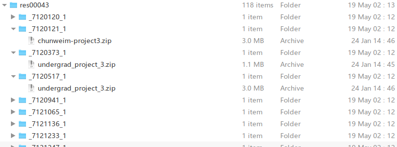
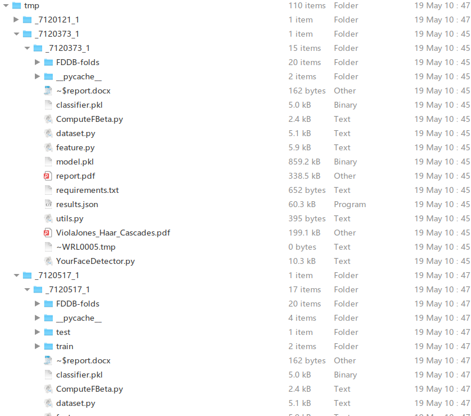
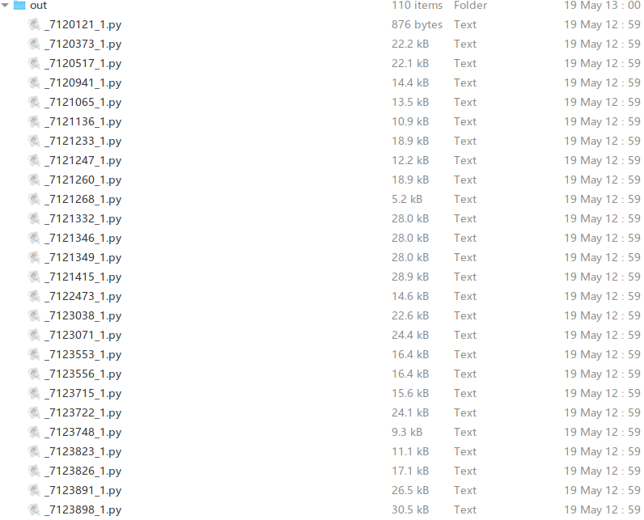

**Concatenation_All_To_One.py**

> Can concatenate all py scripts from a folder to just one py file. 

**Concatenation_Individual_All.py**

> This script can concatenate all py files from each submission package.
>
> After this concatenation, each student's multiple py files will be merged into one.
>
> 
>
> Below is the structure of the **zip_dir** used in the script which can be helpful to understand the code:
>
> 
>
> Below is the structure in **tmp** dir: (This dir is used to save tmp unzipped files)
>
> 
>
> 
>
> Below is the structure in **out** dir: (each students' multiple py files were combined in one file here)
>
> 
>
> ```python
> >>>>>>>>>>>>>>>>>>>>>>>>>>>>>>>>>>>>>>>>>>>>>>>>>>>>>>
> Archive Dir: _7120373_1
> Archive Name: undergrad_project_3.zip
> PY Files in zip:
> 	1 ./tmp/_7120373_1/_7120373_1/utils.py
> 	2 ./tmp/_7120373_1/_7120373_1/feature.py
> 	3 ./tmp/_7120373_1/_7120373_1/YourFaceDetector.py
> 	4 ./tmp/_7120373_1/_7120373_1/dataset.py
> >>>>>>>>>>>>>>>>>>>>>>>>>>>>>>>>>>>>>>>>>>>>>>>>>>>>>>
> 
> 
> ###################################################
> # Inner File: ./tmp/_7120373_1/_7120373_1/utils.py
> ###################################################
> 
> import numpy as np
> from PIL import Image
> import os
> 
> def load_images(path):
>     images = []
>     for _file in os.listdir(path):
>         if _file.endswith('.jpg'):
>             #print(os.path.join(path, _file))
>             img = np.array(Image.open((os.path.join(path, _file))).convert("L"), dtype=np.float32)
>             img /= img.max()
>             images.append(img)
>     return images
> ...........
> 
> ###################################################
> # Inner File: ./tmp/_7120373_1/_7120373_1/feature.py
> ###################################################
> 
> import numpy as np
> from PIL import Image
> from multiprocessing import Pool
> from functools import partial
> from utils import load_images
> import time
> 
> .........
>     
> 
> ###################################################
> # Inner File: ./tmp/_7120373_1/_7120373_1/YourFaceDetector.py
> ###################################################
> 
> from functools import partial
> import numpy as np
> from feature import 
> 
> 
> def train(num_classifiers=80):
> 
>     pos_samples = load_images('../train/positive')
>     neg_samples = load_images('../train/negative')
> 
>     pos_num = len(pos_samples)
>  
> ............
> ###################################################
> # Inner File: ./tmp/_7120373_1/_7120373_1/dataset.py
> ###################################################
> 
> import cv2
> import os
> import numpy as np
> import random
> .........
> ```
>
> 


