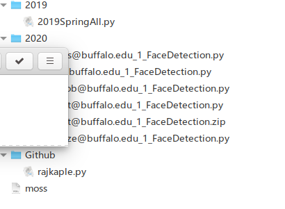

This article includes following sections:

[TOC]


# General Recommended Requirement for Submission

- Package should be submitted in **zip** format

  > There do have students who wrapped their packages in rar format and caused unzip command fail since rar is not supported. 

- Whether script can be split into multiple files

  > Ask them to submit all python files in one file will make it easier to perform moss check since it will be easier to quantify how many lines of code in total in this submission have potential academic integrity issue. But it is still possible to post process and concatenate their files into one if split. 

- Submission package structure, which shall at lease includes instruction on following:

  - Main script name and location

    > Generally the main script shall resides in `src` folder under root directory, however, many students have showed issues in using relative directory to refer files outside `src` folder, it is recommended to ask them to just put main script in the root submission folder.

  - Results file, if required, also needs to specify the location & file name

  - notes, always ask them to create a note in their submission root directory in case they have special requirement to run their script. 

  - Report (if required)

  - All dependencies 

- Directory handling

  > Since Windows and (MacOS, Linux) handle directory in different format, it is strongly recommended to teach them to use general directory handle methods like using python function `os.path.join()` in order to make their code cross platform compatible.

- Argument Parsing

  > A lot common issue is regarding the way how to pass argument into their script. This is critical if we prefer to use auto grading script to run their scripts in batch. Recommend to include an example of how to handle argument passing in the handout.
  >
  > Recommended reference:
  >
  > 	1. https://docs.python.org/3/library/sys.html#sys.argv  (With no flags)
  >
  >  	2. https://docs.python.org/3/library/argparse.html   (With flags)

- Results file format (if applicable)

  > If result files are expected, it is recommended to handout an example of result file sample, an example how to create result file as well as a result file format checker in order to have their submitted results well formatted. 
  >
  > An example of such format checker can be found in: 
  >
  > [checker](../Project3_FaceDetection/Json_Checker_Annotator/)
  >
  > [result creation demo](../Project3_FaceDetection/)

- Submission Guideline

  > A submission guideline is recommended to hand out before the assignment deadline. Sample submission guidelines can be found in project 2 and project 3's grading folder.
  >
  > [Project2's submission guide](../Project2_Panorama/)
  >
  > [Project3's submission guide](../Project3_FaceDetection/)


# Academic Integrity Checking Guide

**<u>It is recommended to have those files ready to perform AI check:</u>**

- All current year's student submission 

  >  each student recommended to have just one file for ease of quantify total number of lines matched with others. If their script are in separate python files, we can concatenate them. See following section regarding how to concatenate them.

- All previous year's submissions 

  > It is recommended to concatenate all files from previous semesters into just one big file in order to eliminate too many pairs of combinations in the check.

- Popular github repository

  > One repo which was fond to be very popular is already included in the "Integrity" folder. 
  >
  > It can be accessed here [Integrity](../Integrity/) 


<u>**File Concatenation:**</u>

The concatenation script can be found in: [concatenation script](../Code_Concatenation/)

There are two scripts resided in this directory. 

- [Concatenation_All_To_One.py](../Code_Concatenation/Concatenation_All_To_One.py) can be used if you want to concatenate all scripts in one folder to one single script. This script normally apply on the history submission packages.

- [Concatenation_Individual_All.py](../Code_Concatenation/Concatenation_Individual_All.py) can be used under the scenario where if each student submits multiple python scripts and you want to concatenate them based on person. This scrip will goes into each submitted zip package, unzip it to tmp directory and recursively search all python scripts (you can specify certain files to exclude) and then combine them to one script per zip package. Depends on the structure of the file directory, some minor changes may needed before running. See the readme underneath this folder for the file structure the script was developed for. 

  

**<u>Moss:</u>**

The moss script can be found here: [moss](../Integrity/)

Please note this moss has been registered already and is ready to use. 

Below is a recommended file structure to run moss. 



The script under 2019 is a combined script with all script from that year. 

The scripts under 2020 are the current years' submissions(The year when this script was developed). Each student's file has been converted into only one file.(We actually required them to submit only one)   

The script under Github is the script where we found many students referred to it.

Following commands can be used to execute moss check:

```bash
./moss -l python ./2019/*.py ./2020/*.py ./Github/*.py
```


# API Checking

If calling API is prohibited, this script [API_Checking](../API_Checking/) can be very helpful. The readme underneath this section provides more details. Please note in order to run this API check, all submitted python file needs to be in one place, which shall be easy to achieve. 

Below is an example of the results. 

| file_name        | line_number | matched_key_word | original code                                                |
| ---------------- | ----------- | ---------------- | ------------------------------------------------------------ |
| xx_project2.py   | 36          | bfmatcher        | def bfmatcher(img1,img2,kp1,des1,kp2,des2,threshold=65, silent=true): |
| xxs2_project2.py | 198         | bfmatcher        | kp_matches,kp_hammdist = bfmatcher(img1,img2,kp_des_pair1[0],kp_des_pair1[1],kp_des_pair2[0],kp_des_pair2[1], threshold=threshold[1]) |
| cs1_project2.py  | 18          | bfmatcher        | matcher = cv2.bfmatcher(cv2.norm_l2, true)                   |
| g21_project2.py  | 13          | findhomography   | def findhomography(matchingpoints):                          |

Note that some students may define functions that matches API name, so a finally manual check is still required to verify the results.